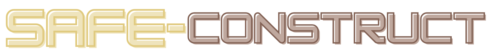
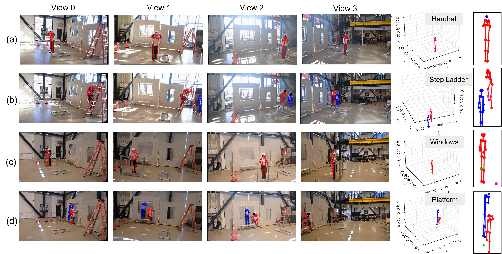

<div align="center">

<br>
# Redefining Construction Safety Violation Recognition as 3D Multi-View Engagement Task
<div>
    <a href='https://aviralchharia.github.io/' target='_blank'>Aviral Chharia</a>&emsp;
    <a href='https://www.linkedin.com/in/tianyur/' target='_blank'>Tinayu Ren</a>&emsp;
    <a href='https://www.andrew.cmu.edu/user/tomotake/' target='_blank'>Tomotake Furuhata</a>&emsp;
    <a href='https://scholar.google.com/citations?user=pgcK25AAAAAJ' target='_blank'>Kenji Shimada</a>&emsp;
</div>
<div>
    Carnegie Mellon University&emsp;<br>
</div>
<div>
    <b>CVPR 2025 Affective Behavior Analysis in-the-wild</b>
</div>
<br>

  <a href="https://arxiv.org/abs/2504.10880"></a>
  <a href="https://safe-construct.github.io/Safe-Construct/"></a>
  [](https://github.com/Safe-Construct/Safe-Construct)

---



<strong> Safe-Construct can detect safety violations with high accuracy in Multi-view Construction Environments.</strong><br>
:open_book: For more visual results, go checkout our <a href="https://safe-construct.github.io/Safe-Construct/" target="_blank">project page</a>
</div>

---

## 🚀 **Updates**
- 🔲 **Coming Soon!**: Safe-Construct Inference Codes and Weights.
- ✅ **May. 18, 2025**: Safe-Construct project page is now live.
- ✅ **Apr. 15, 2025**: We released the Safe-Construct Paper on arXiv. Check the preprint!
- ✅ **Apr. 04, 2025**: Safe-Construct accepted at CVPR 2025 Affective Behavior Analysis in-the-wild. See everyone at Nashville!</i>

## 📖 **Abstract**

Recognizing safety violations in construction environments is critical yet 
remains underexplored in computer vision. Existing models 
predominantly rely on 2D object detection, which fails to capture the 
complexities of real-world violations due to: (i) an oversimplified task 
formulation treating violation recognition merely as object detection, 
(ii) in-adequate validation under realistic conditions, (iii) absence of 
standardized baselines, and (iv) limited scalability from the 
unavailability of synthetic dataset generators for diverse construction 
scenarios. To address these challenges, we introduce Safe-Construct, 
the first framework that reformulates violation recognition as a 3D 
multi-view engagement task, leveraging scene-level worker-object context 
and 3D spatial understanding. We also propose the Synthetic Indoor 
Construction Site Generator (SICSG) to create diverse, scalable training 
data, overcoming data limitations. Safe-Construct achieves a <strong>7.6%</strong> 
improvement over state-of-the-art methods across four violation types. We 
rigorously evaluate our approach in near-realistic settings, incorporating 
four violations, four workers, 14 objects, and challenging conditions like 
occlusions (worker-object, worker-worker) and variable illumination (back-lighting, 
overexposure, sunlight). By integrating 3D multi-view spatial understanding 
and synthetic data generation, Safe-Construct sets a new benchmark for 
scalable and robust safety monitoring in high-risk industries.

## 💻 Demo Implementation

Coming Soon!

## ⭐ Star History

[](https://www.star-history.com/#safe-construct/Safe-Construct&Date)

## ©️ License

Shield: [![CC BY-NC 4.0][cc-by-nc-shield]][cc-by-nc]

This work is licensed under a [Creative Commons Attribution-NonCommercial 4.0 International License][cc-by-nc]. 
Permission is granted for non-commercial research. For commerical use, please reachout to our Lab.

[![CC BY-NC 4.0][cc-by-nc-image]][cc-by-nc]

[cc-by-nc]: https://creativecommons.org/licenses/by-nc/4.0/
[cc-by-nc-image]: https://licensebuttons.net/l/by-nc/4.0/88x31.png
[cc-by-nc-shield]: https://img.shields.io/badge/License-CC%20BY--NC%204.0-lightgrey.svg

## ℹ️ Acknowledgements

Parts of the codes have been taken and adapted from the below repos. Please acknowledge and adhere to the licenses of each repository that Safe-Construct builds upon.
- [YOLOv7](https://github.com/WongKinYiu/yolov7)
- [OpenCV](https://docs.opencv.org/4.x/dc/dbb/tutorial_py_calibration.html)

## 📑 Citation
If you find our work useful for your project, please consider adding a star to this repo and citing our paper:
```bibtex
        @misc{chharia2025safeconstructredefiningconstructionsafety,
        title={Safe-Construct: Redefining Construction Safety Violation Recognition as 3D Multi-View Engagement Task}, 
        author={Aviral Chharia and Tianyu Ren and Tomotake Furuhata and Kenji Shimada},
        year={2025},
        eprint={2504.10880},
        archivePrefix={arXiv},
        primaryClass={cs.CV},
        url={https://arxiv.org/abs/2504.10880}, 
    }
```
